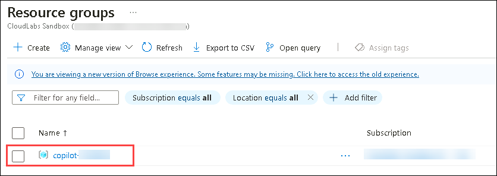
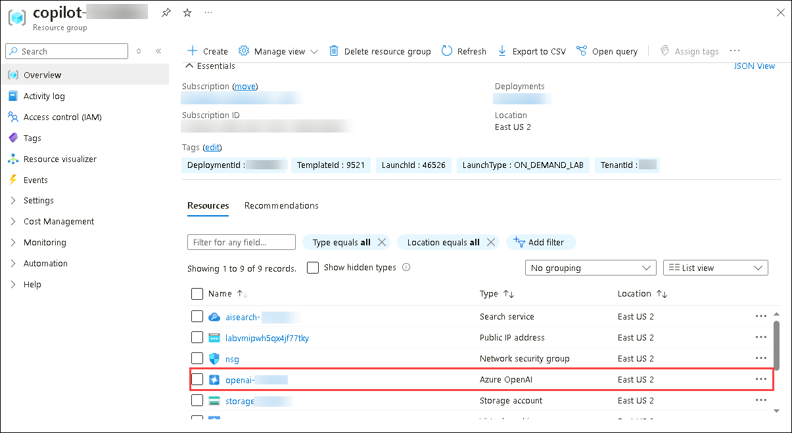
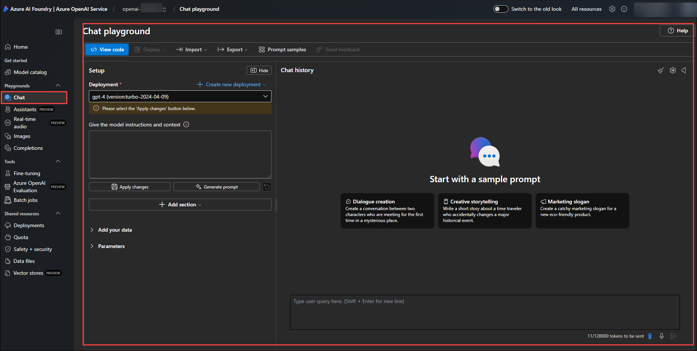

# Exercise 1: Build Retrieval Augmented Generation solution in Azure AI Foundry 

### Estimated Duration: 1 Hour

## Overview

In this exercise, you will learn how to ingest data into a system powered by Azure AI tools and preprocess it using GPT-4 Turbo and text embedding models. The exercise involves connecting a Blob Storage to Azure AI Studio, where various data formats (text, images, and tables) have been uploaded. You will use these files to create vectorized indexes, which will be generated using advanced AI models. After that, you will navigate to Azure AI Search to review the creation and structure of these indexes, ensuring that the data has been successfully ingested and preprocessed.

## Objectives

You will be able to complete the following task:

- Task 1: Overview of RAG and Automation

- Task 2 : Configuring and testing the solution

### Task 1: Overview of RAG and Automation

In this task, you will explore the fundamentals of Retrieval-Augmented Generation (RAG) and its role in creating intelligent, context-aware AI solutions. you'll also set up Copilot Studio.

#### Introduction to Retrieval-Augmented Generation (RAG)

Retrieval-Augmented Generation (RAG) is a powerful approach in AI that combines retrieval techniques with generative models to deliver accurate and contextually rich responses. By integrating external knowledge sources, RAG enables the generation of more informed outputs compared to standalone generative models. Key features of RAG include:

- **Enhanced Contextual Understanding:** Incorporating relevant documents, databases, or files during inference.

- **Dynamic Knowledge Updates:** Ensuring outputs stay accurate and up-to-date without retraining models.

- **Scalability:** Seamlessly handling diverse data sources and scaling to enterprise needs.

### Task 2: Configuring and testing the solution

In this task, you will connect Blob Storage as a data source in Azure AI Studio's Chat Playground. The GPT-4 Turbo and text embedding models will process the uploaded files, extract relevant data, and create indexed vectors in Azure AI Search. You will then review the created indexes.

1. As you have setup Copilot Studio, now it's time to ingest data. Navigate to Azure Portal from your browser.

1. From Azure Portal, scroll down and click on **Resource groups**.

   

1. On Resource groups pane, select resource group **copilot-<inject key="DeploymentID" enableCopy="false" />**.

   

1. From the resource list, select **openai-<inject key="DeploymentID" enableCopy="false" />** AI Service.

   

1. In the Azure OpenAI pane, click on **Go to Azure AI Foundry Portal** to navigate to AI Foundry, where you will be ingesting your data.

   

1. Once you are inside the **Azure AI Foundry**, click on **deployments** to check the deployed models.

   

   > **gpt-4:** GPT-4 Turbo is a powerful variant of the GPT-4 model with enhanced capabilities for both text and image analysis. It can process and understand images alongside text, allowing for tasks like image captioning, object recognition, and visual question answering, making it ideal for multimodal applications.

   > **text-embedding-ada-002:** A text embedding model converts text into a numerical representation (vector), capturing the semantic meaning of the content. These embeddings allow for efficient similarity searches and can be used to compare, cluster, or retrieve relevant information from large text datasets.\

1. In Azure AI Foundry, navigate to chat playground by selecting **chat** option from left menu.

   

1. On chat playground pane, select **Add your data (1)** to ingest data and click on **+ Add a data source (2)**.

   

1. In the **Add data** page, provide the following details and click on **Next (9)**.  

   - **Select data source :** select **Azure Blob Storage (preview) (1)** from dropdown.

   - **Subscription :** Select the available subscription **(2)**.

   - **Select Azure Blob Storage resource :** Select **storage<inject key="DeploymentID" enableCopy="false" />** **(3)** storage account from list.

   - **Select storage container :** select **documents (4)** container.

   - **Select Azure AI Search resource :** select **aisearch-<inject key="DeploymentID" enableCopy="false" />** **(5)** AI Search from list.

   - **Enter the index name :** provide as **phy-index (6)**.

   - **Add vector search to this search resource :** ensure the option is **Checked (7)**

   - **Select an embedding model :** select **Azure OpenAI-text-embedding-ada-002 (8)** model.

     

1. On the Data management pane, keep everything as default and click on **Next**.

   

1. In the **Data connection** page, check the **API Key (1)**, click on **Next (2)** and click on **save and close**.

   

1. Once the Add data pane is closed, you can see **Ingestion in progress** status under Add you data. Please wait until it completes.

   

1. Once the ingestion is completed, navigate back to Azure portal and from the resource list of the resource group, select **aisearch-<inject key="DeploymentID" enableCopy="false" />** AI search.

   

1. In the **Azure AI Search** page, select **indexes** from left menu under Search management, you will be able to see an index with the name **phy-index** has been created.

   

   >**Note:** Please wait until some data populates under **Vector index size**, it may take some time to populate. The data may differ from the value shown in screenshot.

1. Now the data has been ingested, and the index has been created successfully.

1. Now navigate back to **Chat Playground** in Azure AI Foundary Portal, try out these prompts to verify the working of Retrieval Augmented Generation (RAG).

   - `What happens to time when an object moves close to the speed of light?`

   - `Can a cat really be alive and dead at the same time?`

   - `What is the fourth dimension, and how is it related to time?`

   - `Why does the sound of a siren change as it passes you?`

   - `Can you explain the physics behind tsunamis?`

   - `What happens to time if you fall into a black hole?`

<validation step="7a529e69-2cbc-4b21-b367-7d03fe5eabb1" />

> **Congratulations** on completing the task! Now, it's time to validate it. Here are the steps:
> - Hit the Validate button for the corresponding task. If you receive a success message, you can proceed to the next task. 
> - If not, carefully read the error message and retry the step, following the instructions in the lab guide.
> - If you need any assistance, please contact us at cloudlabs-support@spektrasystems.com. We are available 24/7 to help

## Summary

In this exercise, you have navigated to Azure AI Studio and added a data source by connecting Blob Storage to the Chat Playground. You utilized the GPT-4 Turbo and text embedding models to analyze images, text, and tables, generating vectorized indexes. These indexes were then created in the Azure AI Search service, and you reviewed them to confirm the proper ingestion and indexing of the data.

### You have successfully completed this exercise!
