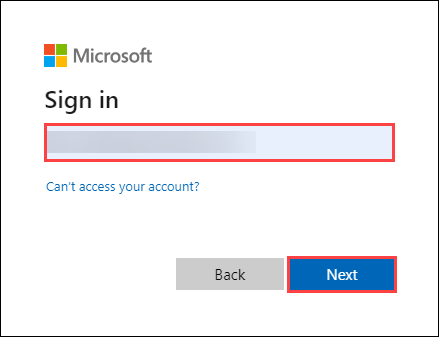

# Exercise 1: Introduction to Retrieval-Augmented Generation (RAG) Automation and Copilot Studio 

## Overview

This exercise introduces the foundational concepts and practical applications of Retrieval-Augmented Generation (RAG) and the capabilities of Copilot Studio in automating intelligent workflows. By combining AI-driven generative models with external knowledge retrieval, participants will learn how to build scalable and dynamic RAG solutions tailored for real-world challenges.

### Task 1: Overview of RAG and Automation

In this task, you will explore the fundamentals of Retrieval-Augmented Generation (RAG) and its role in creating intelligent, context-aware AI solutions. you'll also set up Copilot Studio.

#### Introduction to Retrieval-Augmented Generation (RAG)

Retrieval-Augmented Generation (RAG) is a powerful approach in AI that combines retrieval techniques with generative models to deliver accurate and contextually rich responses. By integrating external knowledge sources, RAG enables the generation of more informed outputs compared to standalone generative models. Key features of RAG include:

- **Enhanced Contextual Understanding:** Incorporating relevant documents, databases, or files during inference.

- **Dynamic Knowledge Updates:** Ensuring outputs stay accurate and up-to-date without retraining models.

- **Scalability:** Seamlessly handling diverse data sources and scaling to enterprise needs.

#### Role of Copilot Studio in Automating RAG Workflows

Copilot Studio streamlines the process of building and automating RAG solutions by offering an intuitive interface for integrating AI capabilities. Key benefits include:

- **Workflow Automation:** Orchestrate end-to-end RAG processes, from data ingestion to output generation.

- **Custom Skills:** Enhance workflows by integrating bespoke logic or domain-specific expertise.

- **Data Management:** Simplify handling diverse input formats like text, Excel, slides, and images.

- **Model Flexibility:** Leverage advanced models such as GPT, embedding models, or hybrid retrieval techniques.

#### Real-World Use Cases

To understand the versatility of RAG, let’s explore some key use cases across different industries:

- **Customer Support:** RAG enhances customer service by providing accurate and context-specific responses. For instance, an AI assistant can use RAG to retrieve information from FAQs, user manuals, or internal knowledge bases to resolve customer queries quickly and efficiently, improving response quality and customer satisfaction.

- **Healthcare:** In healthcare, RAG assists in diagnosing complex cases by retrieving the latest medical research, case studies, and drug information. This ensures that doctors have access to up-to-date, relevant information, enabling better patient outcomes and supporting decisions in critical scenarios.

- **Financial Services:** RAG is helpful in financial services, where it supports wealth managers and advisors by providing personalized investment insights. It retrieves market trends, stock data, and regulatory updates, tailoring advice to individual client profiles. Additionally, it automates the generation of financial reports, streamlining processes and ensuring accuracy.

- **Human Resources:** In HR, RAG can be used to address employee queries by pulling information from company policies, benefits guides, or training documents, enhancing the efficiency of HR operations and improving employee satisfaction.

For this lab, you will focus on the human resources use case, demonstrating how RAG can simplify and enhance workflows in employee queries.

### Task 2: Setting Up Copilot Studio

In this task, you will log in to Copilot Studio and get a high-level overview of its interface and features. This will familiarize you with the platform's capabilities, setting the stage for creating and managing RAG workflows in subsequent tasks.

1. From your browser, navigate to **Copilot Studio** using this link [copilot studio](https://go.microsoft.com/fwlink/p/?linkid=2252408&clcid=0x409&culture=en-us&country=us)

1. Once you navigate, you will be able to see a sign in page, please use the provided details to login and click on **sign in**:

   - **Email/Username:** <inject key="AzureAdUserEmail"></inject>

     

   - **Password:** <inject key="AzureAdUserPassword"></inject>

     

1. Once you are inside **Copilot Studio** you will be in the home page. Keep this browser tab open, we will use this in further exercises.

   

## Summary

In this exercise, you explored the fundamentals of Retrieval-Augmented Generation (RAG) and its role in enhancing AI workflows. You reviewed how RAG integrates external knowledge sources to deliver accurate and context-rich responses. Additionally, you gained an overview of Copilot Studio, learning how it automates RAG workflows and simplifies tasks such as data integration and skill customization. By logging into Copilot Studio, you became familiar with its interface, preparing you to leverage its capabilities for building effective RAG solutions.

### You have successfully completed the lab!