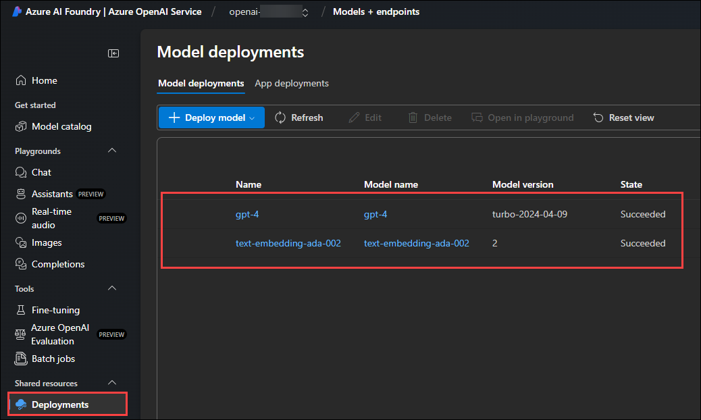
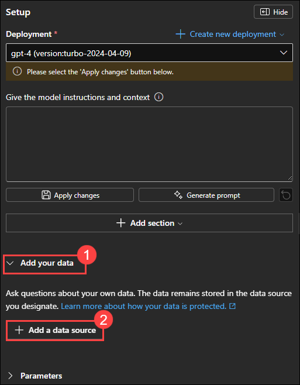
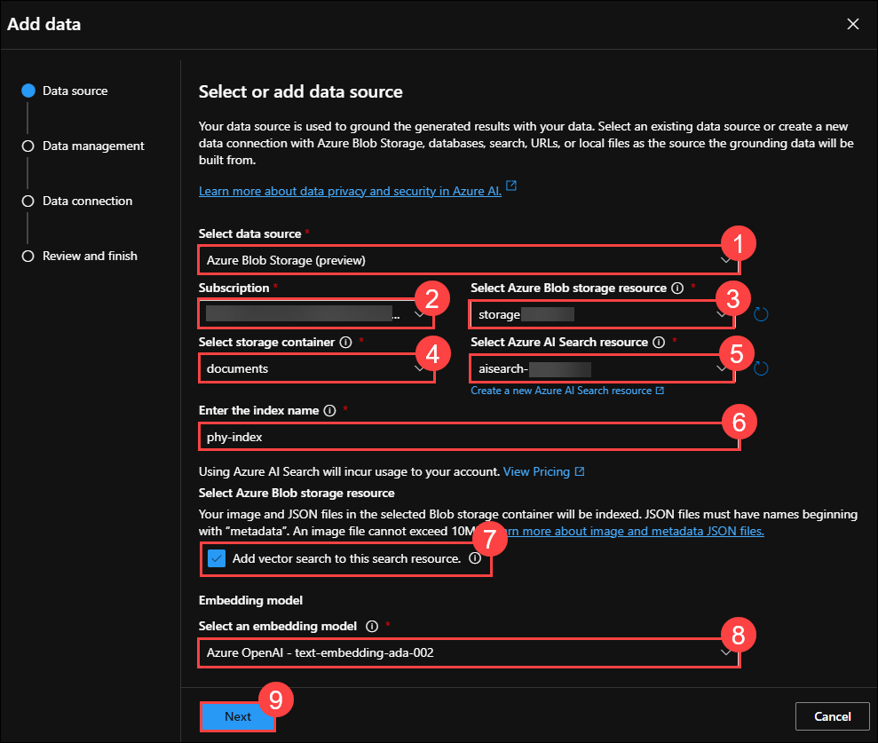
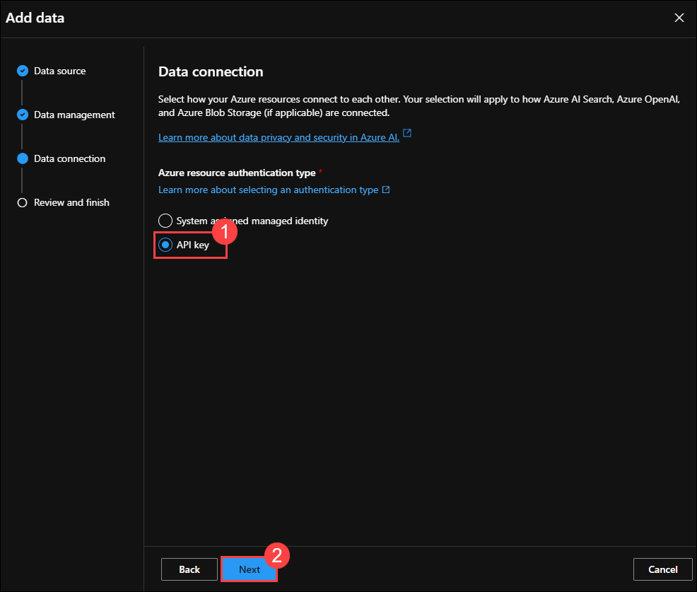
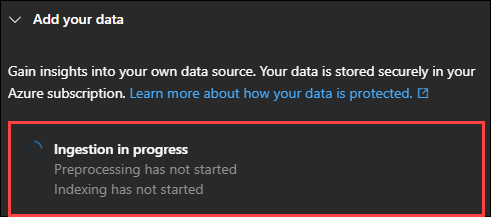

# Exercise 2: Data Ingestion and Preprocessing 

## Overview

In this exercise, you will learn how to ingest data into a system powered by Azure AI tools and preprocess it using GPT-4 Turbo and text embedding models. The exercise involves connecting a Blob Storage to Azure AI Studio, where various data formats (text, images, and tables) have been uploaded. You will use these files to create vectorized indexes, which will be generated using advanced AI models. After that, you will navigate to Azure AI Search to review the creation and structure of these indexes, ensuring that the data has been successfully ingested and preprocessed.

### Task 1: Adding and Configuring a Data Source

In this task, you will connect Blob Storage as a data source in Azure AI Studio's Chat Playground. The GPT-4 Turbo and text embedding models will process the uploaded files, extract relevant data, and create indexed vectors in Azure AI Search. You will then review the created indexes.

1. As you have setup Copilot Stuido, now its time to ingest data. Navigate to Azure Portal from you browser.

1. From Azure Portal, scroll down and click on **Resource groups**.

   

1. On Resource groups pane, select resource group **copilot-<inject key="DeploymentID" enableCopy="false" />**.

   

1. From the resource list, select **openai-<inject key="DeploymentID" enableCopy="false" />** AI Service.

   

1. In the Azure OpenAI pane, click on **Go to Azure OpenAI Studio** to navigate to AI Studio, where you will be ingesting your data.

   

1. Once you are inside **Azure OpenAI Studio**, click on **deployments** to check the models deployed.

   

   > **gpt-4:** GPT-4 Turbo is a powerful variant of the GPT-4 model with enhanced capabilities for both text and image analysis. It can process and understand images alongside text, allowing for tasks like image captioning, object recognition, and visual question answering, making it ideal for multimodal applications.

   > **text-embedding-ada-002:** A text embedding model converts text into a numerical representation (vector), capturing the semantic meaning of the content. These embeddings allow for efficient similarity searches and can be used to compare, cluster, or retrieve relevant information from large text datasets.\

1. In Azure OpenAI Studio, navigate to chat playground by selecting **chat** option from left menu.

   

1. On chat playground pane, select **Add your data (1)** to ingest data and click on **+ Add a data source (2)**.

   

1. In the **Add data** page, provide the following details and click on **Next (9)**.  

   - **Select data source :** select **Azure Blob Storage (preview) (1)** from dropdown.

   - **Subscription :** Select proper subscription **(2)**.

   - **Select Azure Blob Storage resource :** Select **storage<inject key="DeploymentID" enableCopy="false" />** **(3)** storage account from list.

   - **Select storage container :** select **documents (4)** container.

   - **Select Azure AI Search resource :** select **aisearch-<inject key="DeploymentID" enableCopy="false" />** **(5)** AI Search.

   - **Enter the index name :** provide as **phy-index (6)**.

   - **Add vector search to this search resource :** ensure the option is **Checked (7)**

   - **Select an embedding model :** select **Azure OpenAI-text-embedding-ada-002 (8)** model.

     

1. On the Data management pane, keep everything as default and click on **Next**.

   

1. In the **Data connection** page, check the **API Key (1)**, click on **Next (2)** and click on **save and close**.

   

1. Once the Add data pane is closed, you can see **Ingestion in progress** status under Add you data. Please wait till it completes.

   

1. Once the ingestion is completed, navigate back to Azure portal and from the resource list of the resource group, select **aisearch-<inject key="DeploymentID" enableCopy="false" />** AI search.

   

1. In the **Azure AI Search** page, select **indexes** from left menu and you will be able to see an index with the name **phy-index** has been created.

   

   >**Note:** Please wait till some data populates under **Vector index size**, it may take some time to populate. The data may differ from the value shown in screenshot.

1. Now the data is ingested and the index is created successfully.

## Summary

In this exercise, you have navigated to Azure AI Studio and added a data source by connecting Blob Storage to the Chat Playground. You utilized the GPT-4 Turbo and text embedding models to analyze images, text, and tables, generating vectorized indexes. These indexes were then created in the Azure AI Search service, and you reviewed them to confirm the proper ingestion and indexing of the data.

### You have successfully completed this Lab!
