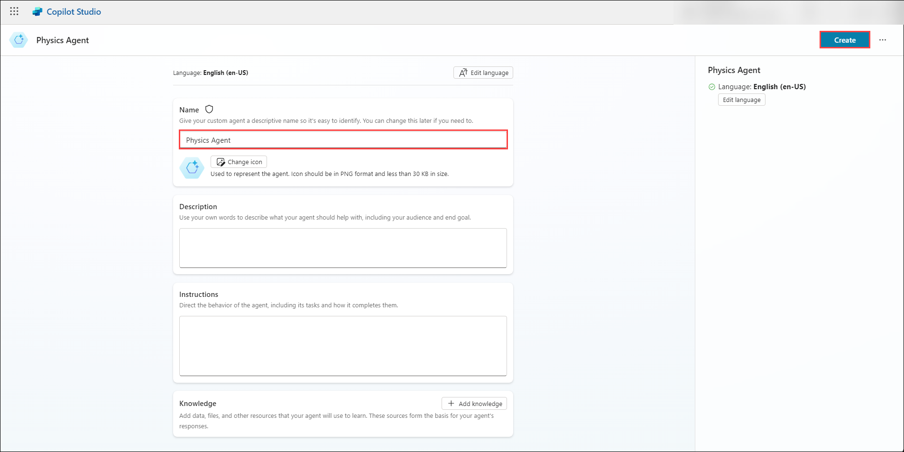
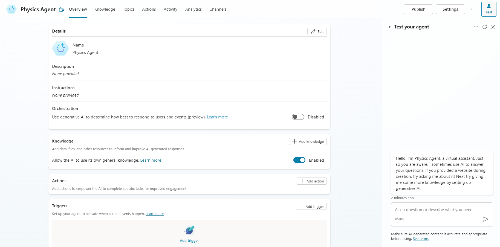
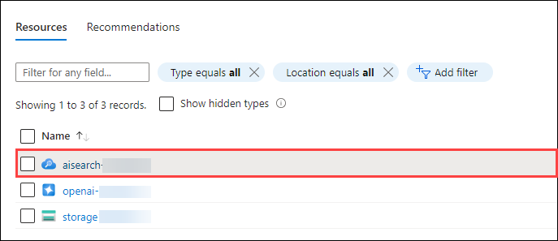
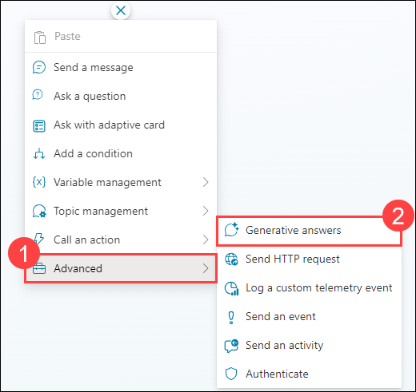
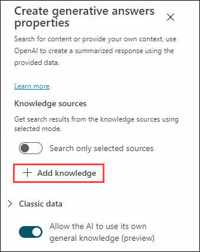
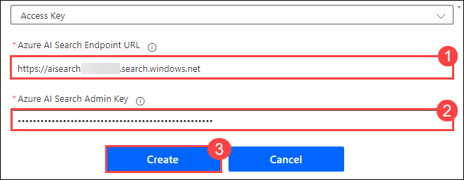
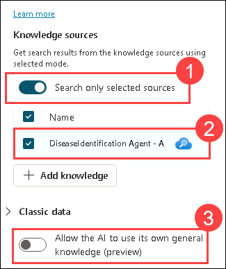
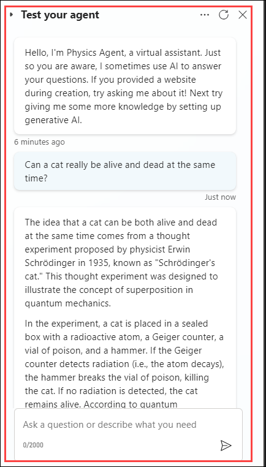

# Exercise 3: Integrating AI Search with Copilot Studio 

### Estimated Duration: 1 Hour 30 Minutes

## Overview

In this exercise, you will integrate AI Search with Copilot Studio to enhance your AI-powered workflows. You will create an agent, improve query processing with custom topics, and test and optimize the Retrieval-Augmented Generation (RAG) pipeline. This hands-on experience will help you use AI Search to better manage and retrieve information from various data sources, making your applications smarter and more efficient.

## Objectives

You will be able to complete the following tasks:

- Task 1 : Creating and Configuring an AI Agent

- Task 2 : Enhancing Query Processing with Custom Topics 

- Task 3 : Testing and Optimizing the RAG Pipeline

### Task 1: Creating and Configuring an AI Agent

In this task, you will create an agent in Copilot Studio. The agent will leverage AI capabilities to process queries and generate responses. 

1. Navigate back to the **Copilot Studio** tab, as you have already logged in, select **Create (1)** from the left menu and click on **New agent (2)** option to create a new AI agent.

   

1. Inside the **Agent** pane click on **Skip to configure** as we will be configuring this further in this exercise.

   

1. In the next pane, provide the **Name** as **Physics Agent** and click on create.

   

1. Now you have successfully created a agent, you will be configuring it in the further tasks.

   

### Task 2: Enhancing Query Processing with Custom Topics 

In this task, you will create custom topics and integrate them with AI Search as a knowledge base. This integration will enhance query processing by providing more relevant, domain-specific responses based on the custom topics you've defined, improving the overall accuracy and utility of the agent’s responses.

1. Before configuring the agent, navigate back to Azure Portal and from the resource list of your resource group, select **aisearch-<inject key="DeploymentID" enableCopy="false" />** AI Search.

   

1. From the overview page, copy the **URL** value and note it safely in a notepad, you will be using this further.

   

1. Select **Keys (1)** from left menu under Settings, copy **Primary admin key (2)** using the option as shown. You will be using this value further in this task.

   

1. Navigate back to Copilot Studio, as you have created an agent, its time to add custom topics to it. In the **Agents** pane, under **Topics** tab, select **+ Add a topic (1)** and click on **From blank (2)** from the dropdown as we are creating a custom topic.

   

   >**LabTip: Topic:** is a structured category of knowledge that helps organize and manage content. It allows the AI to retrieve relevant information from a specific domain.

1. Now you will be navigated to design pane, where you can design the workflow of your topic.

   

1. To build a workflow, click on **+** option as shown.

   

1. Once after clicking on that, select **Advanced (1)** from the menu and click on **Genrative answers (2)**.

   

1. Now the **Create generative answers** component is created, click on **Edit** under **Data sources** to add your knowlegde base.

   

1. Now a new pane will be opend from the left, click on **+ Add knowledge** under Knowledge sources.

   

1. Now in the **Add knowledge** page, select **Advanced (1)** tab and click on **Azure AI Search (2)** as you are integrating Azure AI Search resource.
  
   

1. In the Azure AI Search page, click on **create** option.

   

1. Now provide **Azure AI Search Endpoint URL (1)** and **Azure AI Search Admin Key (2)** values which you have copied earlier and click on **Create (3)**.

   

1. In the next pane, ensure that phy-index is selected and click on **Add**.

   

1. Now the **Create generative answers** component is created, click on **Edit** under **Data sources** to add your knowlegde base.

   

1. In the same pane, under Knowledge sources, toggle **Search only selected sources (1)** button and select **Ai Search (2)** Knowledge base. Make sure that **Allow the AI to use its own general knowledge (preview) (3)** option is turned off.

   

1. Scroll up in the **Creative Generative Answers properties** and close it., in the design pane, under **Create generative answers** click on **>** option as shown.

   

1. A menu will be opened after clicking on it, under **System (1)** select **Activity.Text (2)**.

   

1. Once after adding the input, click on **Save** and provide the name as **phy-topic** and save it.

   

1. Now you have successfully created a agent with your own data. You will test and verify the working of the agent in further task.

### Task 3: Testing and Optimizing the RAG Pipeline

In this task, you will test the RAG pipeline in Copilot Studio. You will evaluate the effectiveness of the integration between AI Search and the agent, test its ability to handle queries, and optimize the pipeline to ensure fast, accurate, and context-aware responses.

1. In the design pane, you will be able to see a chat area in the right as **Test your agent**.
  
   >**Note** : If you don't see the **Test your agent** option, click on **Test** in the top-right corner.

1. In the **Test your agent** pane, use the prompts given here and get the answers for them.

   

1. We've crafted a collection of mind-blowing physics concepts as knwoledge base just for you! Dive in with these prompts, ask away, and unlock the mysteries: 

   - `What happens to time when an object moves close to the speed of light?`

   - `Can a cat really be alive and dead at the same time?`

   - `What is the fourth dimension, and how is it related to time?`

   - `Why does the sound of a siren change as it passes you?`

   - `Can you explain the physics behind tsunamis?`

   - `What happens to time if you fall into a black hole?`

<validation step="adf4bcc6-798f-4532-b12a-14e25ef5e9c6" />

> **Congratulations** on completing the task! Now, it's time to validate it. Here are the steps:
> - Hit the Validate button for the corresponding task. If you receive a success message, you can proceed to the next task. 
> - If not, carefully read the error message and retry the step, following the instructions in the lab guide.
> - If you need any assistance, please contact us at cloudlabs-support@spektrasystems.com. We are available 24/7 to help

## Summary

In this exercise, you integrated AI Search with Copilot Studio to enhance your AI-powered workflows. You created an agent, improved query processing with custom topics, and tested and optimized the Retrieval-Augmented Generation (RAG) pipeline. This hands-on experience helped you use AI Search to better manage and retrieve information from various data sources, making your applications smarter and more efficient.

### You have successfully completed this Exercise!
