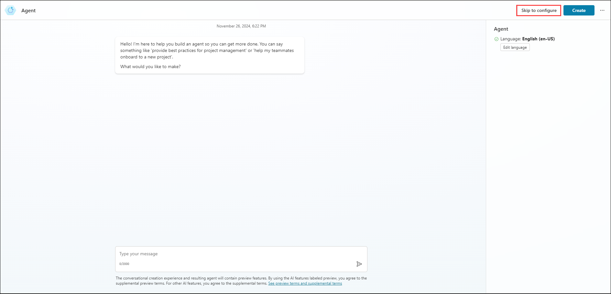
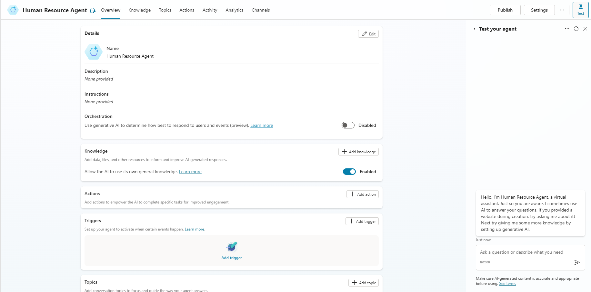
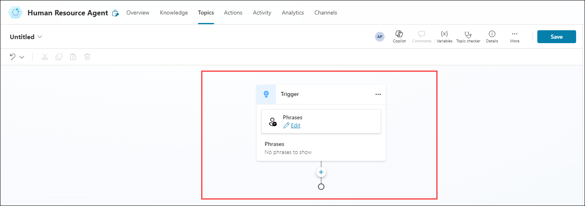
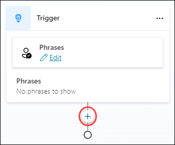
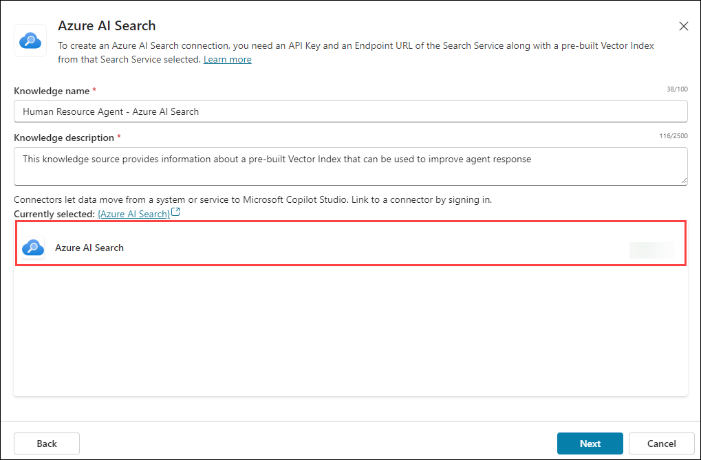
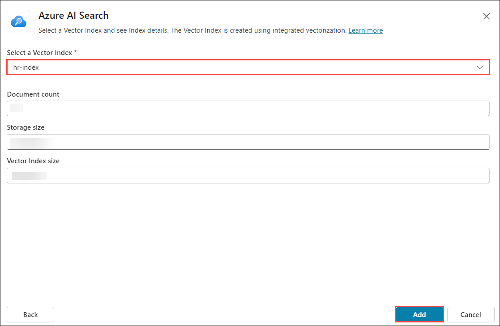
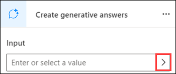
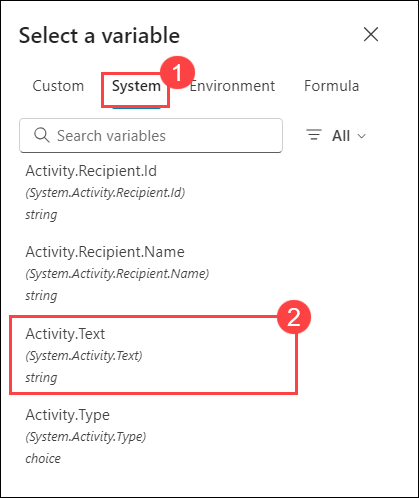
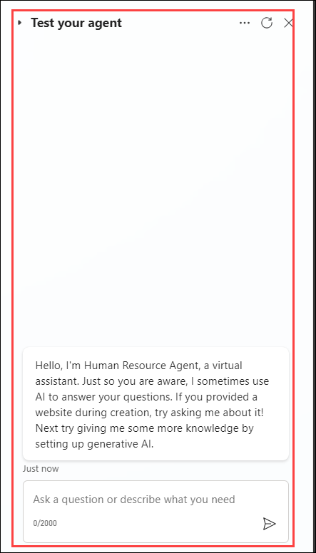

# Exercise 3: Integrating AI Search with Copilot Studio 

## Overview

In this exercise, you will integrate AI Search with Copilot Studio to enhance your AI-powered workflows. You will create an agent, improve query processing with custom topics, and test and optimize the Retrieval-Augmented Generation (RAG) pipeline. This hands-on experience will help you use AI Search to better manage and retrieve information from various data sources, making your applications smarter and more efficient.

### Task 1: Creating and Configuring an AI Agent

In this task, you will create an agent in Copilot Studio. The agent will leverage AI capabilities to process queries and generate responses. 

1. Navigate back to the **Copilot Studio** tab, as you have already logged in, select **Create (1)** from the left menu and click on **New agent (2)** option to create a new AI agent.

   

1. Inside the **Agent** pane click on **Skip to configure** as we will be configuring this further in this exercise.

   

1. In the next pane, provide the **Name** as **Human Resource Agent** and click on create.

   

1. Now you have successfully created a agent, you will be configuring it in the further tasks.

   

### Task 2: Enhancing Query Processing with Custom Topics 

In this task, you will create custom topics and integrate them with AI Search as a knowledge base. This integration will enhance query processing by providing more relevant, domain-specific responses based on the custom topics you've defined, improving the overall accuracy and utility of the agent’s responses.

1. Before configuring the agent, navigate back to Azure Portal and from the resource list of your resource group, select **aisearch-<inject key="DeploymentID" enableCopy="false" />** AI Search.

   

1. From the overview page, copy the **URL** value and note it safely in a notepad, you will be using this further.

   

1. Select **Keys (1)** from left menu, copy **Primary admin key (2)** using the option as shown. You will be using this value further in this task.

   

1. Navigate back to Copilot Studio, as you have created an agent, its time to add custom topics to it. In the **Agents** pane, under **Topics (1)** tab, select **+ Add a topic (2)** and click on **From blank (3)** from the dropdown as we are creating a custom topic.

   

   >**LabTip: Topic:** is a structured category of knowledge that helps organize and manage content. It allows the AI to retrieve relevant information from a specific domain.

1. Now you will be navigated to design pane, where you can design the workflow of your topic.

   

1. To build a workflow, click on **+** option as shown.

   

1. Once after clicking on that, select **Advanced (1)** from the menu and click on **Genrative answers (2)**.

   

1. Now the **Create generative answers** component is created, click on **Edit** under **Data sources** to add your knowlegde base.

   

1. Now a new pane will be opend from the left, click on **+ Add knowledge** under Knowledge sources.

   

1. Now in the **Add knowledge** page, select **Advanced (1)** tab and click on **Azure AI Search (2)** as you are integrating Azure AI Search resource.
  
   

1. In the Azure AI Search page, select **Azure AI Search**.

   

1. Now provide **Azure AI Search Endpoint URL (1)** and **Azure AI Search Admin Key (2)** values which you have copied earlier and click on **Create (3)**.

   

1. In the next pane, ensure that hr-index is selected and click on **Add**.

   

1. Once it is added, in the design pane, under **Create generative answers** click on **>** option as shown.

   

1. A menu will be opened after clicking on it, under **System (1)** select **Activity.Text (2)**.

   

1. Once after adding the input, click on **Save** to save the topic.

   

1. Now you have successfully created a agent with your own data. You will test and verify the working of the agent in further task.

### Task 3: Testing and Optimizing the RAG Pipeline

In this task, you will test the RAG pipeline in Copilot Studio. You will evaluate the effectiveness of the integration between AI Search and the agent, test its ability to handle queries, and optimize the pipeline to ensure fast, accurate, and context-aware responses.

1. In the design pane, you will be able to see a chat area in the right as **Test your agent**.

   