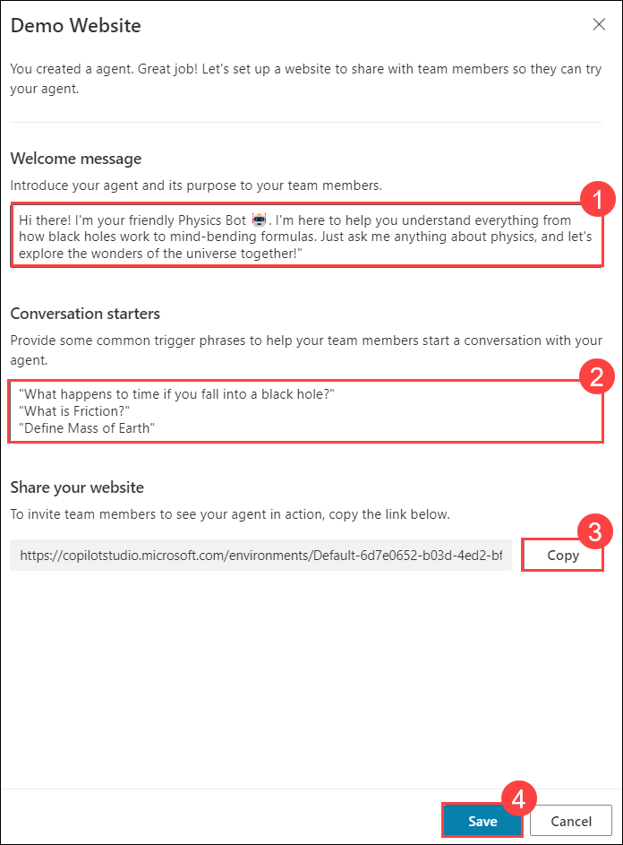
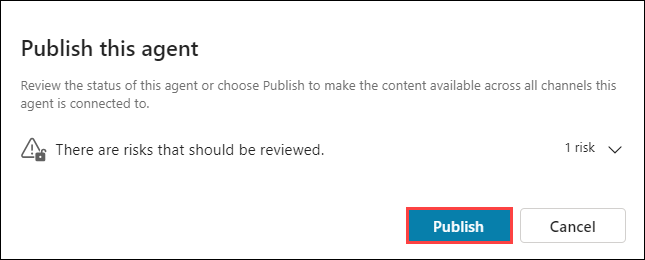
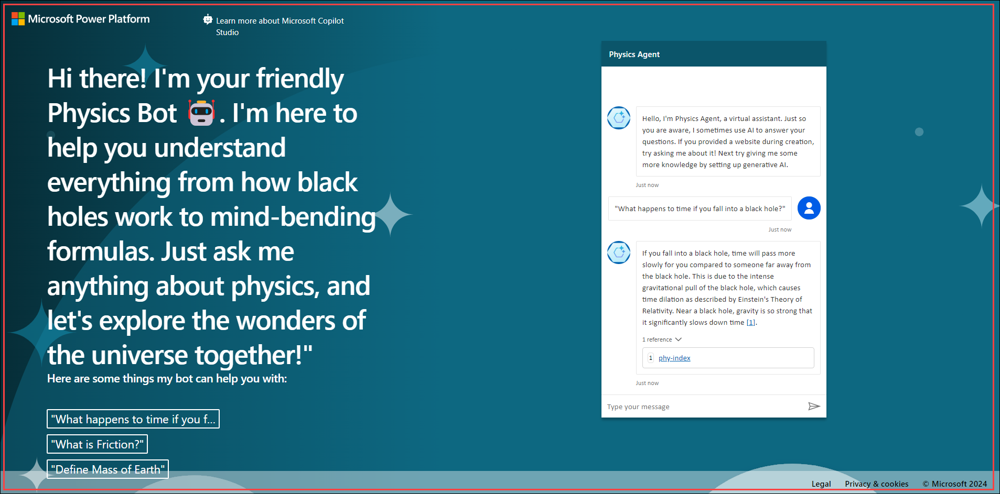

# Exercise 4: Deployment and Publishing Options 

### Estimated Duration: 1 Hour

## Overview

In this exercise, you will explore various deployment and publishing options for your AI-powered solution. The focus will be on integrating Retrieval-Augmented Generation (RAG) with custom platforms, with an emphasis on deploying the solution to a public demo website. Authentication will be removed for this lab, as the application will be deployed as a public website. You will explore different available channels, such as Teams, Slack, and others, but in this exercise, you will configure and publish the app specifically to the Demo Website channel.

## Objectives

- Integrating RAG with Custom Platforms

### Task 1: Integrating RAG with Custom Platforms

In this task, you will integrate your RAG solution with a demo website, using it as the deployment platform. Since the website will be public, authentication will be removed. You will explore the available channels, such as Teams and Slack, but for this exercise, the focus will be on configuring the Demo Website channel and publishing the app.

1. As you have configured and tested your bot, now its time to publish the agent as a demo website.

1. In the Copilot Studio agent page, from the top bar, select **Settings**. 

   

   >**Note** : If you don't see the **Settings** option, click on the **ellipsis (...)** and select **Settings**.

1. From the **Settings** pane, select **Security (1)** from left menu and click on **Authentication (2)**.

   

1. Under **Authentication**, choose **No authentication (1)** option, as we are publishing the agent as a website. Click on **Save (2)**.

   

1. Once the authentication part is done, navigate to **Channels (1)** tab and check that many options are available to publish the agent, but in this lab we will be using **Demo webiste (2)** option, so click on that.

   

   >Other Options:

    - **Teams:** Publishing your AI-powered agent in Microsoft Teams enables seamless integration with one of the most widely used collaboration platforms in businesses. By deploying the agent within Teams, employees or teams can interact with it directly within their workflows. This is particularly useful for support bots, HR bots, project management, or task automation, where the agent can assist in real-time communication, meetings, or project channels. Teams bots can also use advanced features like adaptive cards and proactive messaging to keep users informed and engaged.

    - **Slack:** Slack is another popular team collaboration tool. By publishing your agent to Slack, you enable your team to integrate the AI agent directly into channels, direct messages, or workflows. Slack bots can automate tasks like setting reminders, providing data reports, answering FAQs, or assisting with specific workflows such as onboarding.

    - You can explore more on these publishing options using this [Reference](https://learn.microsoft.com/en-us/microsoft-copilot-studio/publication-fundamentals-publish-channels?tabs=web)

1. Once the **Demo Website** option is selected, a new pane will be opened from left. In that pane, provide a friendly welcome message and few prompts to try as follows:

   - **Welcome message:** `Hi there! I'm your friendly Physics Bot 🤖. I'm here to help you understand everything from how black holes work to mind-bending formulas. Let's explore the wonders of the universe together!` **(1)** 

   - **Conversation starters: (2)** 
      - `What happens to time if you fall into a black hole?`
      - `What is Friction?`
      - `Define Mass of Earth`

   -  Use the **Copy (3)** button to copy the URL of the website, note it down safely and click on **Save (4)**.

      

1. Once the configurations saved, close the tab and click on **Publish** from the top menu.

   

1. On **Publish this agent** pane, click on **Publish**.

   

1. Once it is published, open a new tab in the browser and use the URL copied o navigate to the **Demo Website**. You will see a pleasant user interface with our agent will be opened, which copilot handled for us.

   

## Summary

In this exercise, you explored various deployment and publishing options for your AI-powered solution. The focus was on integrating Retrieval-Augmented Generation (RAG) with custom platforms, with an emphasis on deploying the solution to a public demo website. Authentication was removed for this lab, as the application was deployed as a public website. You examined different available channels, such as Teams, Slack, and others, but the primary focus was on configuring and publishing the app specifically to the Demo Website channel.

### You have successfully completed the Lab!